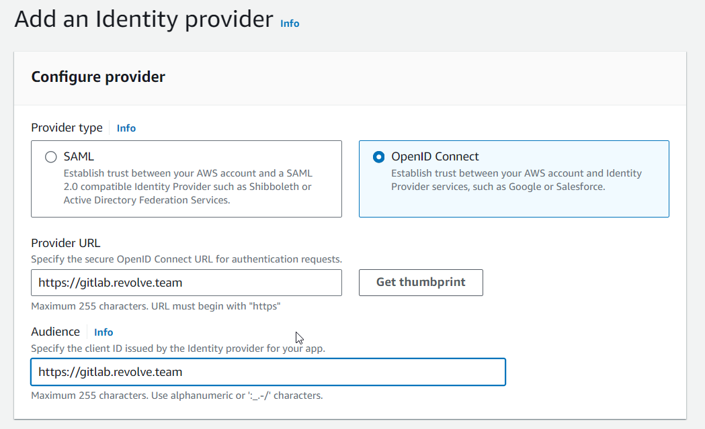
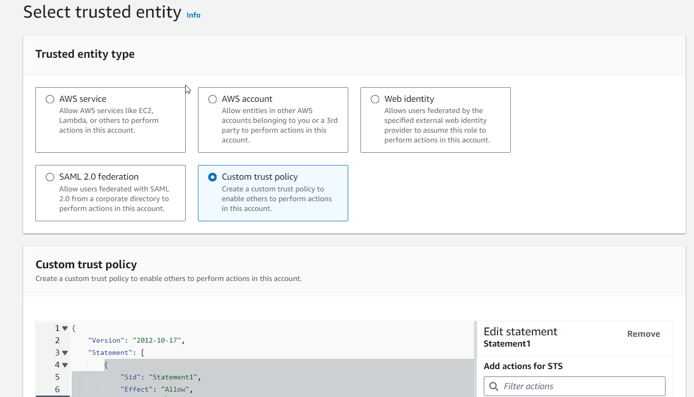
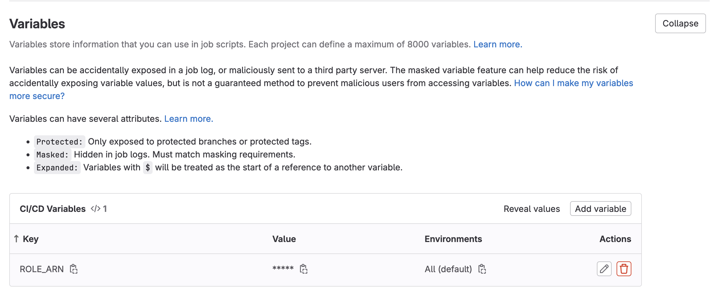

<!-- BEGIN_TF_DOCS -->
## Requirements

No requirements.

## Providers

| Name | Version |
|------|---------|
|  [archive](#provider\_archive) | n/a |
|  [aws](#provider\_aws) | n/a |

## Modules

No modules.

## Resources

| Name | Type |
|------|------|
| [aws_api_gateway_deployment.handson_deployment](https://registry.terraform.io/providers/hashicorp/aws/latest/docs/resources/api_gateway_deployment) | resource |
| [aws_api_gateway_integration.lambda_integration](https://registry.terraform.io/providers/hashicorp/aws/latest/docs/resources/api_gateway_integration) | resource |
| [aws_api_gateway_method.route_methods](https://registry.terraform.io/providers/hashicorp/aws/latest/docs/resources/api_gateway_method) | resource |
| [aws_api_gateway_method_response.route_method_responses](https://registry.terraform.io/providers/hashicorp/aws/latest/docs/resources/api_gateway_method_response) | resource |
| [aws_api_gateway_resource.handson](https://registry.terraform.io/providers/hashicorp/aws/latest/docs/resources/api_gateway_resource) | resource |
| [aws_api_gateway_resource.root](https://registry.terraform.io/providers/hashicorp/aws/latest/docs/resources/api_gateway_resource) | resource |
| [aws_api_gateway_rest_api.handson](https://registry.terraform.io/providers/hashicorp/aws/latest/docs/resources/api_gateway_rest_api) | resource |
| [aws_iam_policy.policy](https://registry.terraform.io/providers/hashicorp/aws/latest/docs/resources/iam_policy) | resource |
| [aws_iam_role.handson](https://registry.terraform.io/providers/hashicorp/aws/latest/docs/resources/iam_role) | resource |
| [aws_iam_role_policy_attachment.api_gateway](https://registry.terraform.io/providers/hashicorp/aws/latest/docs/resources/iam_role_policy_attachment) | resource |
| [aws_iam_role_policy_attachment.handson](https://registry.terraform.io/providers/hashicorp/aws/latest/docs/resources/iam_role_policy_attachment) | resource |
| [aws_lambda_function.lambda_functions](https://registry.terraform.io/providers/hashicorp/aws/latest/docs/resources/lambda_function) | resource |
| [archive_file.lambda_archives](https://registry.terraform.io/providers/hashicorp/archive/latest/docs/data-sources/file) | data source |

## Inputs

| Name | Description | Type | Default | Required |
|------|-------------|------|---------|:--------:|
|  [lambda\_functions](#input\_lambda\_functions) | n/a | <pre>map(object({     function_name    = string     handler          = string     source_code_path = string   }))</pre> | n/a | yes |
|  [name\_role](#input\_name\_role) | n/a | `any` | n/a | yes |
|  [region](#input\_region) | n/a | `any` | n/a | yes |
|  [routes](#input\_routes) | n/a | <pre>map(object({     method = string     path   = string   }))</pre> | n/a | yes |

## Outputs

| Name | Description |
|------|-------------|
|  [api\_gateway\_urls](#output\_api\_gateway\_urls) | n/a |
<!-- END_TF_DOCS -->

## list action for deploy on gitlabci

### requirement aws

**create oidc**

**create role**

add trust relationship on custom trust policy

        {
            "Version": "2012-10-17",
            "Statement": [
                {
                    "Effect": "Allow",
                    "Principal": {
                        "Federated": "arn_oidc"
                    },
                    "Action": "sts:AssumeRoleWithWebIdentity",
                    "Condition": {
                        "StringEquals": {
                            "gitlab.revolve.team:sub": "project_path:name_orga/name_repo:ref_type:branch:ref:branch_name"
                        }
                    }
                }
            ]
        }

change:

- arn_oidc
- name_orga
- name_repo
- branch_name (default `main`)

add policie for deploy terraform

### requirement gitlabci

download zip [here](https://gitlab.revolve.team/jeremy.monnier/handson-cicd)

create repo on gitlabci

add variable on project in gitlabci settings/cicd:

- ROLE_ARN

## gitlab - Jenkins

create repo gitlab

create personal access token

create iam role on your aws account with custom trust policie

        {
            "Version": "2012-10-17",
            "Statement": [
                {
                    "Effect": "Allow",
                    "Principal": {
                        "AWS": "arn:aws:iam::897644935672:role/ecs_task_execution_role"
                    },
                    "Action": "sts:AssumeRole"
                }
            ]
        }

add policie on your role for deploy terraform

send arn iam role for authorize jenkins to assume your role

create credentials jenkins administrer:

- click  jenkins/credentials/system/identifiants globaux/add creation

- create secret gitlab on jenkins with id on specify with your name for sample

- create secret aws on jenkins with id on specify with your name for sample specifies your role create on aws

create multibranche pipeline jenkins:

- click new item
- choose name
- choose multibranch pipeline
- click add on branch sources choose gitlab project
- choose your Checkout Credentials
- fill owner
- choose your project
- add parameters Filter by name and fill main on Include
- choose other parameters if necessary

modify Jenkinsfile with id credentials aws
